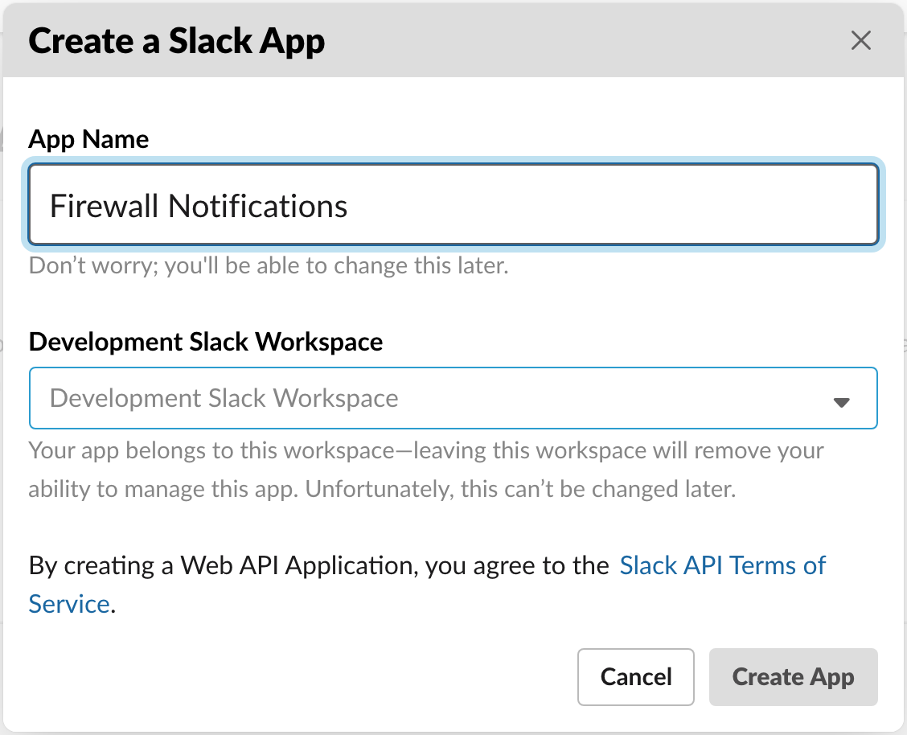
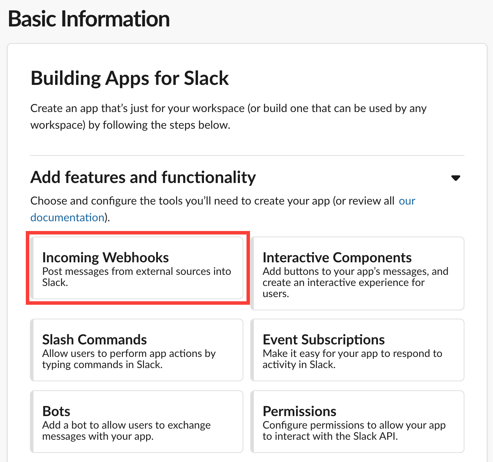
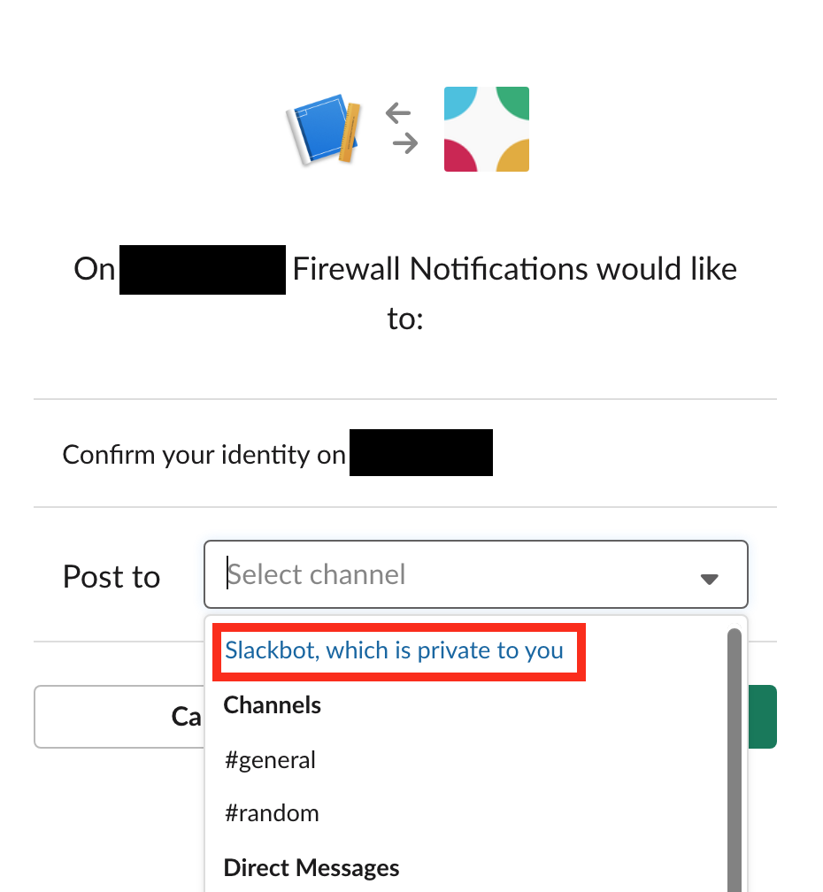
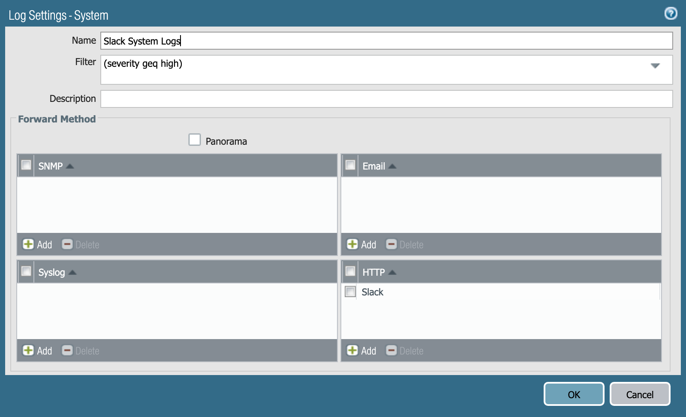
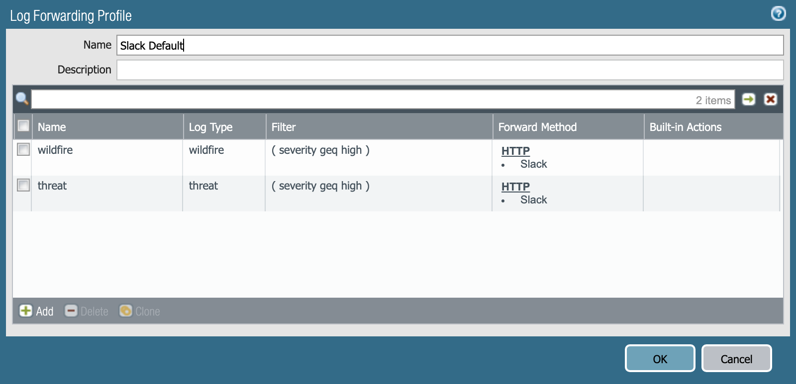
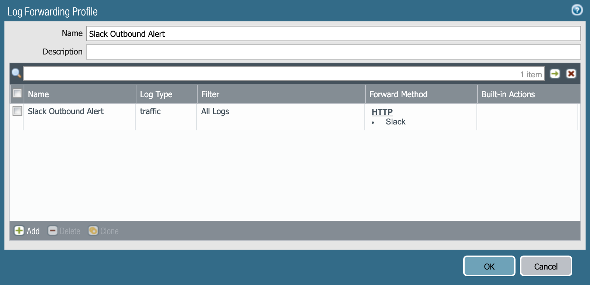

# Slack Notifications Skillet

This skillet configures HTTP notifications to a Slack webhook for monitoring of
events on a PAN-OS firewall.  This posts important system, threat, and traffic
log entries to a channel of your choice, making monitoring of a home firewall
(or any low traffic firewall) easy.  This is also intended to demonstrate how
to integrate PAN-OS with a typical HTTP webhook. 

## Setting up the Slack webhook

For more information on Slack webhooks, see the
[Incoming Webhooks](https://api.slack.com/incoming-webhooks) API documentation.

### Create a Slack app

Create a Slack app by clicking [here](https://api.slack.com/apps/new).

Pick a name and choose a workspace to install your app to.

### Enable Incoming Webhooks for your app

On the Your Apps page, edit your app, then click
**Add Features and Functionality**, and select **Incoming Webhooks**.

On the next page, toggle **Activate Incoming Webhooks**, and click
**Add New Webhook to Workspace**.

This is where you specify what channel messages are going to be delivered to.
For testing, select **Slackbot, which is private to you** to ensure that
messages only get delivered to you during testing.

You may want to additionally create a dedicated channel.

## Usage

### Parameters

- **webhook_uri_format**: This is the portion of the generated webhook URL
  without `https://hooks.slack.com/`.
- **profile_name**: Name of the HTTP server profile that gets created.
- **fw_name**: String prefix that gets added to messages posted to the Slack
  channel.  This is useful if you have multiple firewalls sending events to a
  single channel.

### Outputs

Running this skillet will configure:

- An HTTP server profile for the Slack webhook‘s URL
- Critical and high system logs to the Slack webhook
- Logging profile to forward critical and high threat and Wildfire events to the
  webhook
- Logging profile to forward traffic events to the webhook

### Intended Usage

Critical and high system logs are forwarded to the channel using the 
*Slack System Logs* profile.

Critical and high threat and Wildfire events are forwarded to the channel using
the *Slack Default* profile.  Use this profile as the default logging profile
for rules, only forwarding events that need immediate admin follow up.

All traffic matches are forwarded to the channel by the *Slack Outbound Alert*.
Use this profile on rules to notify the admin of traffic to known compromised
hosts, or any other traffic you want to know about immediately.

## Support Policy

The code and templates in the repo are released under an as-is, best effort,
support policy. These scripts should be seen as community supported and
Palo Alto Networks will contribute our expertise as and when possible.
We do not provide technical support or help in using or troubleshooting the
components of the project through our normal support options such as
Palo Alto Networks support teams, or ASC (Authorized Support Centers)
partners and backline support options. The underlying product used
(the VM-Series firewall) by the scripts or templates are still supported,
but the support is only for the product functionality and not for help in
deploying or using the template or script itself. Unless explicitly tagged,
all projects or work posted in our GitHub repository
(at https://github.com/PaloAltoNetworks) or sites other than our official
Downloads page on https://support.paloaltonetworks.com are provided under
the best effort policy.